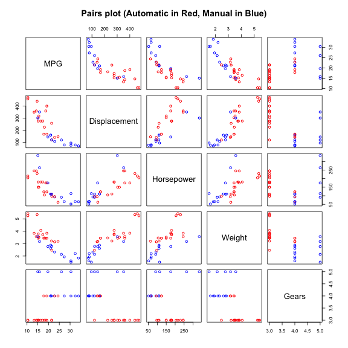
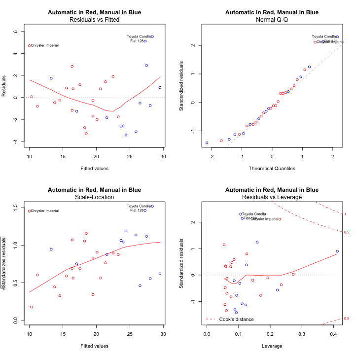

# An Analysis of Fuel Efficiency by Transmission Type   

## Summary
The purpose of this analysis was to determine in what manner the type of transmission an automobile has affects its fuel efficiency in miles per gallon (MPG).  In addition to examining what effect transmission type has on MPG, the effects from other variables were also considered.  This was necessary because many of the variables were related.  For example, consider the variables Weight and Transmission Type.  Luxury cars are often large and heavy and come with automatic transmissions, so it may appear that automatic transmissions lead to lower MPG values, while it is in fact due to the high weight of the car.  What was found that in general, automobiles with manual transmission tend to have higher MPG than automatic transmission automobiles, but that this difference is not likely due to the transmission type.  Variables such as engine horse power and automobile weight are stronger predictors for MPG than transmission type.

#### Source of the data
The data was extracted from a 1974 issue of the automobile magazine *Motor Trend*, and lists fuel consumption and other characteristics for 32 automobiles from the years 1973 and 1974.  Please see the Appendix for more information about the dataset.  Information about the dataset can be found at this URL: http://stat.ethz.ch/R-manual/R-devel/library/datasets/html/mtcars.html. 

## Exploring the data


The analysis will begin with some visual exploration of the data.  The box plot below immediately gives us a possible indication that automobiles with manual transmissions appear to be more fuel efficient.  Automobiles with automatic transmissions have a median MPG of about 17.3 while automobiles with manual transmissions have a median MPG of about 22.8.  

 

However, though automobiles with manual transmissions appear to be more fuel efficient in general, it is not possible to conclude at this point that this difference is due to transmission type solely.  It may be that all cars with manual transmissions happen to also be very light and have small engines.  Below is a pairs plot of some of variables in order to see how they relate to each other.

 

A few expected correlations are immediately seen, for example, that Displacement and Horsepower are positively correlated.  Neither is it surprising that Weight and MPG have a negative correlation.  Another interesting relationship is that between Transmission Type and Gears (number of forward gears in the transmission).  We see that all automobiles with three gears are automatics, and all with five gears are manuals.  Automobiles with four gears are primarily manuals.  


```
##            
##              3  4  5
##   Automatic 15  4  0
##   Manual     0  8  5
```

## Fitting a linear model

Six predictors will be used in order to understand how transmission type relates to fuel efficiency.  Those six predictors are:
- TransType
- Cylinders
- Displacement
- Horsepower
- Weight
- Gears

A linear model is fitted for the following six combinations of the six predictors, and then the anova() function in R is used to compare the six linear models.


```
## Analysis of Variance Table
## 
## Model 1: MPG ~ TransType
## Model 2: MPG ~ TransType + Horsepower
## Model 3: MPG ~ TransType + Horsepower + Weight
## Model 4: MPG ~ TransType + Horsepower + Weight + Displacement
## Model 5: MPG ~ TransType + Horsepower + Weight + Displacement + Gears
## Model 6: MPG ~ TransType + Horsepower + Weight + Displacement + Gears + 
##     Cylinders
##   Res.Df RSS Df Sum of Sq     F Pr(>F)    
## 1     30 721                              
## 2     29 245  1       475 72.90  7e-09 ***
## 3     28 180  1        65  9.99 0.0041 ** 
## 4     27 180  1         0  0.06 0.8104    
## 5     26 178  1         2  0.30 0.5867    
## 6     25 163  1        15  2.28 0.1436    
## ---
## Signif. codes:  0 '***' 0.001 '**' 0.01 '*' 0.05 '.' 0.1 ' ' 1
```

The results of this test indicate that Model 3 would be a reasonable model to select, due to the fact that Model 4 has a large p-value, indicating that it is not very different from Model 3.  Though this method implicitly favored the predictors TransType, Horsepower, and Weight due to the fact that they were included in all six models for testing, it is reasonable that engine horsepower and the weight of the automobile are important predictors.  Leaving Displacement out of model is also justified due to the fact that it is highly correlated with both Weight and Horsepower, which were included.

## Diagnostics

Now we will look at some diagnostic plots in order to verify that the model assumptions are being reasonably met.
 

The first plot, Residuals by Fitted values, shows that the constant variance assumption is reasonably met and that the data is reasonably linear.  The second plot (going by rows) confirms that the residuals have an approximately normal distribution.  Conducting the Shapiro-Wilk test for the normality of the residuals gives a p-value of 0.1059, meaning that there is not quite enough evidence to suggest the residuals are non-normal.  These plots also highlight a few outliers, namely the Chrysler Imperial, the Toyota Corolla, and the Fiat 128.  Below is a table of the 8 automobiles with the highest difference between their true MPG and the predicted MPG, found in column ErrorMPG.


```
##                    MPG Horsepower Weight TransType PredictedMPG ErrorMPG
## Toyota Corolla    33.9         65  1.835    Manual       28.368    5.532
## Fiat 128          32.4         66  2.200    Manual       27.280    5.120
## Chrysler Imperial 14.7        230  5.345 Automatic        9.997    4.703
## Mazda RX4         21.0        110  2.620    Manual       24.422    3.422
## AMC Javelin       15.2        150  3.435 Automatic       18.493    3.293
## Datsun 710        22.8         93  2.320    Manual       25.923    3.123
## Lotus Europa      30.4        113  1.513    Manual       27.496    2.904
## Pontiac Firebird  19.2        175  3.845 Automatic       16.376    2.824
```

One interesting thing to note is the similarities between the Toyota Corolla and the Fiat 128, at least among the three predictor variables being used.  We also see that the Chrysler Imperial is an exceptionally large car at 5345 pounds, with a lot of horsepower and an automatic transmission.  It is seemingly a large luxury car.  Our model underestimated its MPG by 4.7032.  There are no other automobiles similar to it at the top of the list of automobiles with large errors in the prediction.  Going back to the Corolla and Fiat 128, let us see what other similarities they had:


```
##              Toyota Corolla Fiat 128
## MPG          33.9           32.4    
## Cylinders    4              4       
## Displacement 71.1           78.7    
## Horsepower   65             66      
## DRatio       4.22           4.08    
## Weight       1.835          2.200   
## QuarTime     19.90          19.47   
## VS           1              1       
## TransType    Manual         Manual  
## Gears        4              4       
## Carbs        1              1       
## PredictedMPG 28.37          27.28   
## ErrorMPG     5.532          5.120
```
Not only are the two automobiles similar in our three predictor variables, but also equivalent or similar in Cylinders, Displacement, DRatio, QuarTime, Gears, Carbs, and even (true) MPG!  As expected, the model makes a similar MPG prediction for both automobiles, of about 27 to 28 MPG.  For both, this prediction is about 5 MPG too low.  To improve this model, it may be possible to find out why the model underestimates their MPG and perhaps make an adjustment.  For now, since the model assumptions are being met and since the value of R^2 is 0.8399 with just three predictors, we can leave further investigation for another time.

## Results & Conclusions

Let us take a look again at the chosen model, which uses TransType, Horsepower, and Weight to predict MPG.


```
## 
## Call:
## lm(formula = MPG ~ TransType + Horsepower + Weight, data = data)
## 
## Residuals:
##    Min     1Q Median     3Q    Max 
## -3.422 -1.792 -0.379  1.225  5.532 
## 
## Coefficients:
##                 Estimate Std. Error t value Pr(>|t|)    
## (Intercept)     34.00288    2.64266   12.87  2.8e-13 ***
## TransTypeManual  2.08371    1.37642    1.51  0.14127    
## Horsepower      -0.03748    0.00961   -3.90  0.00055 ***
## Weight          -2.87858    0.90497   -3.18  0.00357 ** 
## ---
## Signif. codes:  0 '***' 0.001 '**' 0.01 '*' 0.05 '.' 0.1 ' ' 1
## 
## Residual standard error: 2.54 on 28 degrees of freedom
## Multiple R-squared:  0.84,	Adjusted R-squared:  0.823 
## F-statistic:   49 on 3 and 28 DF,  p-value: 2.91e-11
```
Let us also take a look at a visualization of our model, which shows the small difference in MPG attributed to TransType, as well as negative correlation associated with higher Horsepower and Weight values.

 

We see that on average an automobile with a manual transmission gets 2.08 more MPG than an automobile with an automatic transmission, if the amount of horsepower and the weight of the automobile are held constant.  However, this estimate has a p-value of 0.14, which is higher than ideal (meaning not very significant).  

### answering our two questions...

1) **Is an automatic or manual transmission better for MPG?**
- Answer: The data suggests that when ignoring all other variables and focusing solely on transmission type, a car with a manual transmission will get more MPG than a car with an automatic transmission.  Running a t-test on the MPG values:


```
## 
## 	Welch Two Sample t-test
## 
## data:  autoMPG and manuMPG
## t = -3.767, df = 18.33, p-value = 0.001374
## alternative hypothesis: true difference in means is not equal to 0
## 95 percent confidence interval:
##  -11.28  -3.21
## sample estimates:
## mean of x mean of y 
##     17.15     24.39
```
We can say that a typical manual automobile gets about 7.24 more MPG than automatic one, and this value is significantly different than 0.  However, if an automobile's horsepower and weight are taken into account, that difference in MPG drops to 2.08, and that difference is no longer considered significant.  If the question refers to the vehicle in general, then yes, driving an automobile with a manual transmission will very likely secure you a higher MPG.  If the question refers to specifically the transmission, then though a manual transmission appears to give you about 2.08, it cannot be confidently said that this difference is significantly different than a difference of 0. 

2) **Quantify the MPG difference between automatic and manual transmissions.**
- Answer: Basically reiterating from the previous question and answer, automobiles with manual transmissions tend to have get about 7.24 more MPG than automobiles with automatic transmissions.  This fact, however, is not due to the transmissions themselves, but largely due to other factors.  For a given weight and horsepower, a manual transmission will deliver about 2.08 more MPG than an automatic transmission, though this difference was not found to be statistically significant (within this model).  The best that can be said at this time is that there is weak evidence for a small effect due to transmission types.

## _


